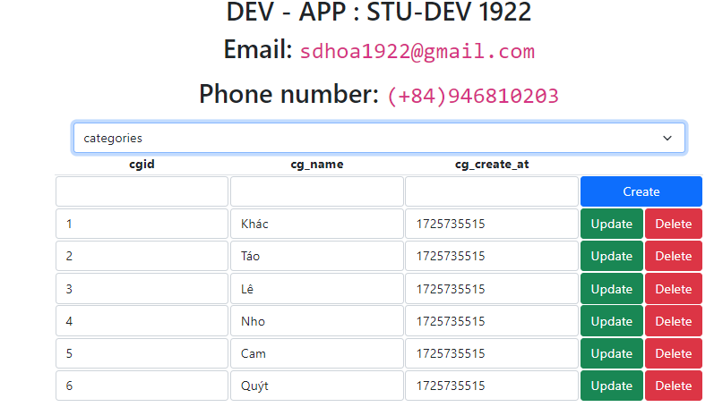

## TERMINAL SCRIPTS
<table>
    <caption>TEST CASE COMMAND</caption>
    <thead>
        <tr>
            <th>name</th>
            <th>command</th>
            <th>note</th>
        </tr>
    </thead>
    <tbody>
        <tr>
            <td>main start</td>
            <td>npm start</td>
            <td>Start The Server (backend - frontend)</td>
        </tr>
        <tr>
            <td>main test</td>
            <td>npm test</td>
            <td>main's test case</td>
        </tr>
        <tr>
            <td colspan=3>
                <em>DATABASE SCRIPTS</em>
            </td>
        </tr>
        <tr>
            <th rowspan=2>npm run db</th>
            <td>npm run db.create</td>
            <td>Create database</td>
        </tr>
        <tr>
            <td>npm run db.insert</td>
            <td>Insert data into table</td>
        </tr>
        <tr>
            <td colspan=2>npm run db.show-data</td>
            <td>Show all data from tables</td>
        </tr>
        <tr>
            <td style="color:red; text-align:center" colspan=3>
                <em>CLIENT (UI)</em>
            </td>
        </tr>
        <tr>
            <td style="color:yellow" colspan=3>
                
            </td>
        </tr>
    </tbody>
</table>
